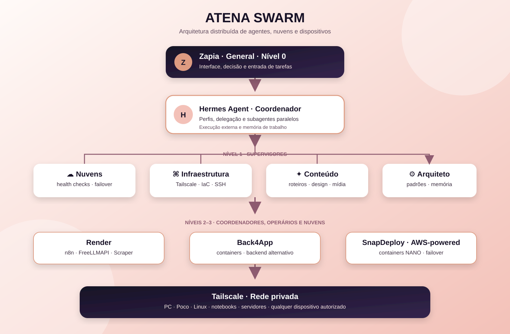

# Atena Swarm Architecture

Arquitetura distribuída para a Atena: Zapia coordena agentes especializados, Hermes executa e delega tarefas, e a infraestrutura é distribuída entre múltiplas plataformas de nuvem conectadas por uma rede privada Tailscale.

> **Status do projeto:** documentação arquitetural e blueprint de implementação. Os componentes estão em diferentes níveis de uso: alguns conectados e operacionais, outros planejados ou monitorados.

## Visão geral

```text
Zapia — General / Nível 0
        │
        ▼
Hermes Agent — Coordenação
        │
        ├── Supervisor de Nuvens
        ├── Supervisor de Infraestrutura e Tailscale
        ├── Supervisor de Conteúdo
        └── Supervisor Arquiteto
                │
                ▼
        Coordenadores e operários especializados
                │
                ▼
Render · Back4App · SnapDeploy/AWS · NVIDIA NIM · GitHub
```



## Princípios

- **Peso Zero no celular:** o Poco C85 funciona como interface/relay; processamento e automação ficam na nuvem sempre que possível.
- **GitHub é o código oficial:** os serviços puxam o código dos repositórios públicos da Atena.
- **Tailscale é a rede privada:** conecta dispositivos e nós autorizados sem expor serviços diretamente à internet.
- **Hermes é o coordenador externo:** delega tarefas a subagentes e perfis especializados.
- **NANO/quântico:** cada serviço deve ser mínimo, enxuto e adequado ao free tier.
- **Segurança:** tokens, senhas e chaves nunca entram no repositório.

## Nuvens e base AWS

As plataformas utilizadas funcionam sobre infraestrutura de nuvem baseada em AWS ou declaradamente AWS-powered. A arquitetura aproveita o mesmo modelo conceitual de infraestrutura usado em ambientes AWS modernos:

- instâncias e workloads isolados;
- redes privadas e segmentação;
- rotas e regras de acesso;
- balanceamento e distribuição de tráfego;
- disponibilidade em múltiplas zonas/regiões quando oferecida pela plataforma;
- containers enxutos e escaláveis;
- armazenamento e serviços gerenciados.

**Importante:** a Atena utiliza Render, Back4App e SnapDeploy como plataformas de implantação. Isso não significa que tenhamos acesso direto às contas ou aos recursos internos da AWS dessas plataformas. O termo AWS descreve a base de infraestrutura; o gerenciamento é feito pelas APIs e painéis das próprias plataformas.

### Plataformas

| Plataforma | Papel na Atena | Relação com AWS |
|---|---|---|
| Render | n8n, FreeLLMAPI e Scraper Quântico | infraestrutura AWS-hosted, conforme documentação da Render |
| Back4App | alternativa para containers e backend | infraestrutura AWS declarada pela plataforma |
| SnapDeploy | containers NANO/quânticos e failover | AWS-powered container hosting |
| NVIDIA NIM | inferência de modelos de linguagem | serviço externo de inferência |

## Rede de dispositivos

Além do PC e do Poco C85, **qualquer dispositivo compatível pode ser adicionado à rede privada Tailscale**, desde que seja autorizado:

- computador fraco;
- notebook;
- servidor Linux;
- celular ou tablet;
- Raspberry Pi ou equipamento semelhante;
- workstation mais avançada;
- outro nó de nuvem compatível.

Um equipamento fraco pode atuar como interface, relay ou executor leve. Um equipamento mais avançado pode receber tarefas maiores. A rede não acelera automaticamente um dispositivo apenas por adicionar outro: o ganho vem do **offloading**, da distribuição de tarefas e da coordenação entre os nós.

## Rodízio planejado

| Horário (BRT) | Plataforma principal | Função |
|---|---|---|
| 07:00–18:00 | Render | operação principal |
| 18:00–01:00 | Back4App | janela alternativa |
| 01:00–07:00 | SnapDeploy/AWS-powered | janela noturna |

O failover deve ser automatizado por health checks e APIs, sempre respeitando os limites do plano gratuito.

## Componentes

- **Zapia:** interface e General da arquitetura.
- **Hermes Agent:** coordenador externo, perfis e subagentes.
- **Tailscale:** rede privada entre nós autorizados.
- **n8n:** automações e workflows.
- **NVIDIA NIM:** motor de inferência de texto.
- **GitHub:** versionamento e distribuição do código.
- **TeraBox:** backup, não execução.
- **PC Celeron:** terminal de administração.
- **Poco C85:** interface/relay passivo.

## Estado conhecido

### Conectado ou operacional

- Tailscale no PC e no Poco.
- API do Tailscale.
- GitHub.
- API do Render.
- n8n no Render.
- FreeLLMAPI no Render.
- Scraper Quântico no Render.
- NVIDIA NIM provisionado.

### Em implantação ou validação

- Hermes Agent no PC Windows.
- Ponte Linux persistente.
- OpenSSH Server no PC.
- Integração IaC com Pulumi.
- Back4App e SnapDeploy para failover automatizado.
- Supervisores completos do Atena Swarm.

## Segurança

Nunca publique neste repositório:

- tokens de GitHub, Tailscale, NVIDIA, Cloudflare ou Hugging Face;
- senhas de banco ou n8n;
- arquivos `.env`;
- credenciais de login;
- números pessoais ou dados privados.

Use variáveis de ambiente e secrets da plataforma.

## Licença

Documentação pública da arquitetura Atena Swarm. Código e componentes derivados devem manter as licenças de seus projetos de origem.
